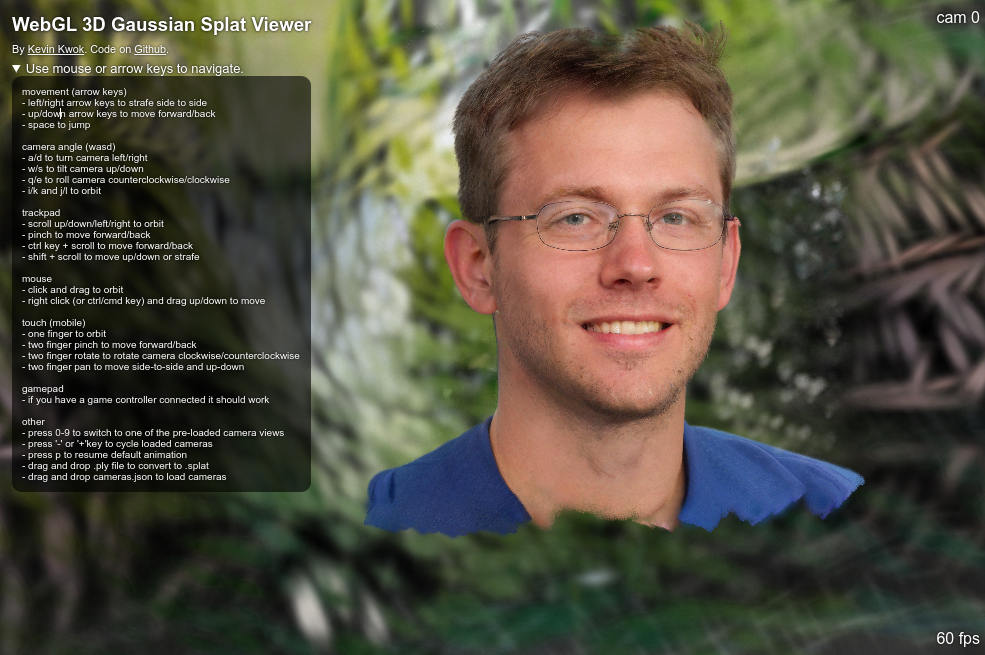

# [NeurIPS 2024] Adversarial Generation of Hierarchical Gaussians for 3D Generative Model

<a href="https://hse1032.github.io/gsgan" target="_blank">[Project page]</a>
<a href="https://arxiv.org/abs/2406.02968" target="_blank">[Paper]</a>
<a href="https://arxiv.org/abs/2406.02968" target="_blank">[Arxiv]</a>
<!-- <a href="https://openreview.net/forum?id=U2WjB9xxZ9q" target="_blank">[OpenReview]</a> -->

Official pytorch implementation for "Adversarial Generation of Hierarchical Gaussians for 3D Generative Model"


### Update logs
- 🎆 (24/09/26) We are excited to announce that our paper has been accepted at NeurIPS 2024!
- :star: (24/08/29) We just uploaded the pretrained checkpoints (https://drive.google.com/open?id=1S7ct8GGQebBOyjmRvBZW0KkwXBxLsqe6)!

## Environment setting
We build our code on EG3D (https://github.com/NVlabs/eg3d) and 3D-GS (https://github.com/graphdeco-inria/gaussian-splatting).
Please dependencies of those two repository to run the codes. \
One different thing is that we use different version for "diff-gaussian-rasterization" that support depth and alpha rendering in the link "https://github.com/ashawkey/diff-gaussian-rasterization".

Or you can run below code snippet for installing dependencies.

```
conda env create -f environment.yml
conda activate gsgan

git clone --recursive https://github.com/ashawkey/diff-gaussian-rasterization
pip install ./diff-gaussian-rasterization
```

## Pretrained checkpoints
Pretrained checkpoints are available in Google Drive link (https://drive.google.com/open?id=1S7ct8GGQebBOyjmRvBZW0KkwXBxLsqe6).


## Data preprocessing
We exactly follow the data-preprocessing of EG3D, so please refer to them (https://github.com/NVlabs/eg3d).


## Training
We provide the training script in "_scripts/train_{dataset}.sh" file.
Only need to change is the "dataset_path" variable.
Training results are saved at "outdir" directory.
```
sh _script/train_afhq512.sh     # training on AFHQ512
sh _script/train_ffhq512.sh     # training on FFHQ512
```


## Evaluation
We provide the evaluation of FID.
Set the path of "network_pkl" in "_scripts/eval.sh" file properly, and run it. \
Or you can simply run below code for evaluation.

```
python calc_metrics.py --metrics=fid50k_full --network=${network_pkl}
```


## Generating media
Set the path of "network_pkl" in "_scripts/generate_videos.sh" file properly, and run it. \
Or you can simply run below code for generating videos.

```
python gen_videos.py --outdir=out --trunc=0.7 --seeds=0-3 --grid=2x2 \
    --network=${network_pkl}
```

and we provide some visualization parameters in 338-349 lines in "gen_videos_gsparams.py" as belows.

```
    # Configuration for visualization
    gs_params = {
        "rendering_scale": 0,                           # reduce the scale of Gaussians at rendering
        "res_visualize": res_visualize,                 # visualizing specific blocks only (e.g. [0, 1] for two coarsest blocks)
        "disable_background": False,                    # True, for disabling background generator
        "opacity_ones": opacity_ones,                   # True, for setting opacity of Gaussians to 1
        "point_index": point_index,                     # index of the initial point and its children to visualize
        "num_init_near_point": num_init_near_point,     # number of points to visualize near the initial point (use with "point_index")
        "visualize_anchor": visualize_anchor,           # visualinzg anchors, not actual Gaussians
        'visualize_index': False,                       
        'camera_cond': [[-4.7208e-08, 4.7208e-08,  - 1.0000e+00]], # camera direction condition of color layer for visualization (fix for consistent representation)
    }
```

## Export ply for interactive viewer

Our generation script outputs the gaussians of the first seed in ply format (.ply), which can be visualized by viewers for gaussian splatting. \
So if you want to visualize gaussians with an interactive viewer, you can use this ply file.

Below is an example of visualization with web viewer provided in (https://github.com/antimatter15/splat).




## Acknowledgement
Our code is based on the following repositories. \
EG3D (https://github.com/NVlabs/eg3d) \
Gaussian-Splatting (https://github.com/graphdeco-inria/gaussian-splatting) \
dreamgaussian (https://github.com/dreamgaussian/dreamgaussian)


## Contact
For any further questions, please contact hse1032@gmail.com


## Citation
If our paper or codebase is useful in your research, please cite our paper!
```
@article{hyun2024adversarial,
  title={Adversarial Generation of Hierarchical Gaussians for 3D Generative Model},
  author={Hyun, Sangeek and Heo, Jae-Pil},
  journal={arXiv preprint arXiv:2406.02968},
  year={2024}
}
```
